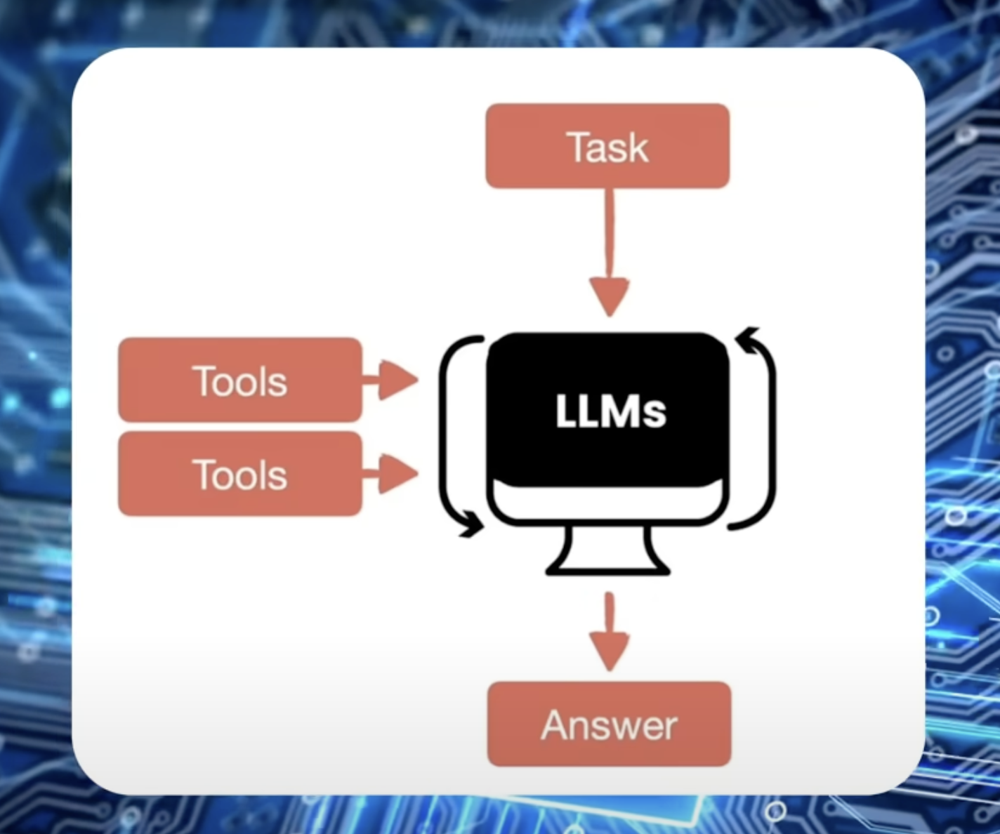
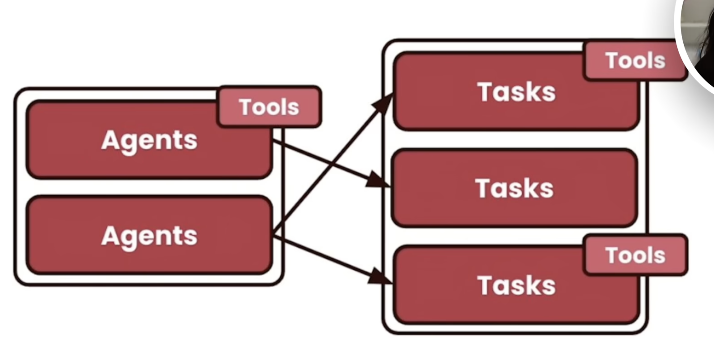

# AI Agent

## Agent Types

### Non-Agentic Workflow

- One-Pass execution: completes a task in one go, without iteration
- No adjustments
- E.g.,: prompting ChatGPT

### Agentic Workflow

- Step-by-step execution: Breaks tasks into stages (planning, research, drafting, revising)
- Feedback loop: AI iterates based on human guidance

### Autonomous AI Agent

- Fully independent AI: AI determines steps, tools, and iterates without human involvment
- Adaptive decision-making: AI adjusts workflow dynamically to achieve the best outcome

## Agents Architecture

### 1. Single-Agent

- Task
- Tool1
- Tool2
- Answer

Example:

- Task: plan a 3 day trip to Tokyo on a budget
- Tools: Google maps, skyscanner, booking.com, saved credit card
- Answer: detailed itinerary with locations, costs, hotels, and tickets

### 2. Double-Agent

- Two AI agents working together
- Ex: One AI agent is responsible for writing the text, the other for reviewing

#### Multi-agent patterns

1. Sequential: One agent starts, the other continues after this one has finished
   - like an assembly line
2. Hierarchical: It has a leader/manager agent, which supervises the tasks of the other agents
   - The task-agents complete their task and "report back" to the manager
3. Hybrid: Combines sequential and hierarchical features
   - Top-down and sequentially
4. Parallel: Agents working on different work streams independently
5. Async: Agents execute tasks independently and asynchronously
   - Real-time monitoring, self-healing systems gain a lot from this

### 3. Resources

[n8n](https://n8n.io/)
[n8n GitHub](https://github.com/n8n-io/n8n)

- "For every SaaS company, there will be a corresponding AI agent company"

### 4. How to Build them

Example:

- 1. Content creation
  - Social media
  - Newsletter
  - Youtube Scripts
    If you just hired someone to take care of content creation, without onboarding, you would have lame content. The same is with AI. It needs ideas and instructions

#### 4.1 Fine-Tuned AI Model

- Show a bunch of examples of what the output should look like
- Specialize your AI by training it on specific data
- Dataset: 20 - 50 examples

  - Reverse engineer the post

- Access Open AI API > dashboard > Fine-tuning
- All this trained AI data should be uploaded as `.jsonl`
- The AI should sound like you and say things that you'd say

#### 4.2 Brand brief

- Provide clear, writing guidelines describing your brand
- Think about your personal brand
- Key themes, vision, mission, statement, objectives, target audience, unique value propositions, tone of voice

#### 4.3 Building a team of AI agents

Team of agents

- 1. Idea generator
- 2. Content writer
- 3. Editor/refiner

##### n8n

- n8n can be installed and run locally, so you can generate the content totally free of charge
- You can also self-host it
